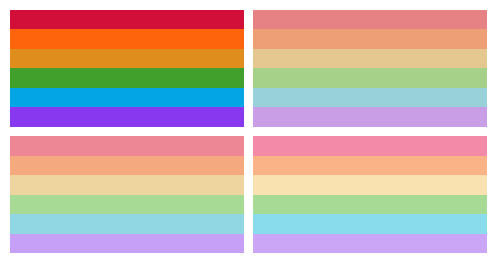
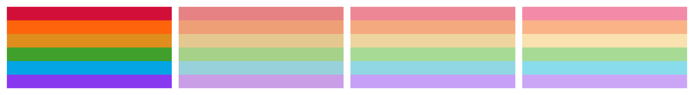
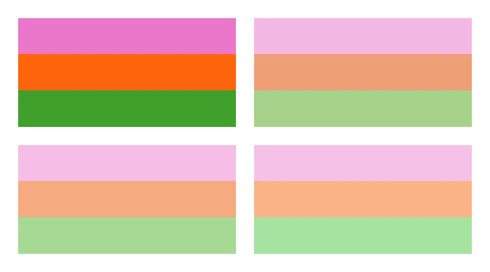
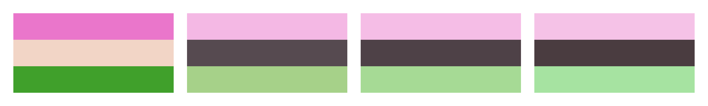
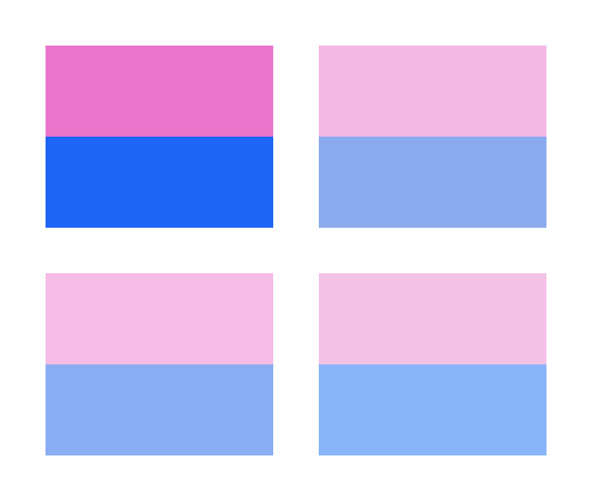
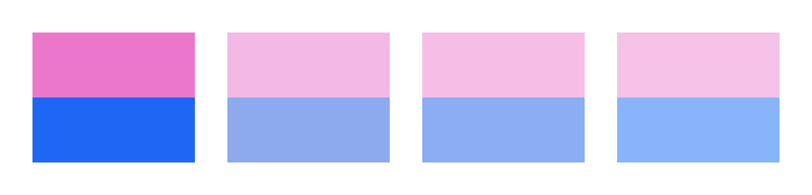

<h3 align="center">
	 
	
	Catppuccin for Flags
	
</h3>

## Flags

<!-- AUTOGEN:FLAGLIST START -->
<!-- the following section is auto-generated, do not edit -->

Attraction

- Aromantic Asexual ([Mocha](themes/mocha/aroace/), [Macchiato](themes/macchiato/aroace/), [Frappé](themes/frappe/aroace/), [Latte](themes/latte/aroace/))  - , , 
- Asexual ([Mocha](themes/mocha/asexual/), [Macchiato](themes/macchiato/asexual/), [Frappé](themes/frappe/asexual/), [Latte](themes/latte/asexual/))  - , , 
- Bisexual ([Mocha](themes/mocha/bisexual/), [Macchiato](themes/macchiato/bisexual/), [Frappé](themes/frappe/bisexual/), [Latte](themes/latte/bisexual/))  - , , 
- Gay ([Mocha](themes/mocha/gay/), [Macchiato](themes/macchiato/gay/), [Frappé](themes/frappe/gay/), [Latte](themes/latte/gay/))  - , , 
- Greysexual ([Mocha](themes/mocha/greysexual/), [Macchiato](themes/macchiato/greysexual/), [Frappé](themes/frappe/greysexual/), [Latte](themes/latte/greysexual/))  - , , 
- Gynesexual ([Mocha](themes/mocha/gynesexual/), [Macchiato](themes/macchiato/gynesexual/), [Frappé](themes/frappe/gynesexual/), [Latte](themes/latte/gynesexual/))  - , , 
- Lesbian ([Mocha](themes/mocha/lesbian/), [Macchiato](themes/macchiato/lesbian/), [Frappé](themes/frappe/lesbian/), [Latte](themes/latte/lesbian/))  - , , 
- Pansexual ([Mocha](themes/mocha/pansexual/), [Macchiato](themes/macchiato/pansexual/), [Frappé](themes/frappe/pansexual/), [Latte](themes/latte/pansexual/))  - , , 
- Polysexual ([Mocha](themes/mocha/polysexual/), [Macchiato](themes/macchiato/polysexual/), [Frappé](themes/frappe/polysexual/), [Latte](themes/latte/polysexual/))  - , , 

Expression

- Demiboy ([Mocha](themes/mocha/demiboy/), [Macchiato](themes/macchiato/demiboy/), [Frappé](themes/frappe/demiboy/), [Latte](themes/latte/demiboy/))  - , , 
- Demigirl ([Mocha](themes/mocha/demigirl/), [Macchiato](themes/macchiato/demigirl/), [Frappé](themes/frappe/demigirl/), [Latte](themes/latte/demigirl/))  - , , 
- Femboy ([Mocha](themes/mocha/femboy/), [Macchiato](themes/macchiato/femboy/), [Frappé](themes/frappe/femboy/), [Latte](themes/latte/femboy/))  - , , 

Fluidity

- Genderfluid ([Mocha](themes/mocha/genderfluid/), [Macchiato](themes/macchiato/genderfluid/), [Frappé](themes/frappe/genderfluid/), [Latte](themes/latte/genderfluid/))  - , , 
- Pansexual ([Mocha](themes/mocha/pansexual/), [Macchiato](themes/macchiato/pansexual/), [Frappé](themes/frappe/pansexual/), [Latte](themes/latte/pansexual/))  - , , 
- Polysexual ([Mocha](themes/mocha/polysexual/), [Macchiato](themes/macchiato/polysexual/), [Frappé](themes/frappe/polysexual/), [Latte](themes/latte/polysexual/))  - , , 
- Trigender ([Mocha](themes/mocha/trigender/), [Macchiato](themes/macchiato/trigender/), [Frappé](themes/frappe/trigender/), [Latte](themes/latte/trigender/))  - , , 

Gender

- Agender ([Mocha](themes/mocha/agender/), [Macchiato](themes/macchiato/agender/), [Frappé](themes/frappe/agender/), [Latte](themes/latte/agender/))  - , , 
- Cisgender ([Mocha](themes/mocha/cisgender/), [Macchiato](themes/macchiato/cisgender/), [Frappé](themes/frappe/cisgender/), [Latte](themes/latte/cisgender/))  - , , 
- Demiboy ([Mocha](themes/mocha/demiboy/), [Macchiato](themes/macchiato/demiboy/), [Frappé](themes/frappe/demiboy/), [Latte](themes/latte/demiboy/))  - , , 
- Demigirl ([Mocha](themes/mocha/demigirl/), [Macchiato](themes/macchiato/demigirl/), [Frappé](themes/frappe/demigirl/), [Latte](themes/latte/demigirl/))  - , , 
- Femboy ([Mocha](themes/mocha/femboy/), [Macchiato](themes/macchiato/femboy/), [Frappé](themes/frappe/femboy/), [Latte](themes/latte/femboy/))  - , , 
- Genderfluid ([Mocha](themes/mocha/genderfluid/), [Macchiato](themes/macchiato/genderfluid/), [Frappé](themes/frappe/genderfluid/), [Latte](themes/latte/genderfluid/))  - , , 
- Genderqueer ([Mocha](themes/mocha/genderqueer/), [Macchiato](themes/macchiato/genderqueer/), [Frappé](themes/frappe/genderqueer/), [Latte](themes/latte/genderqueer/))  - , , 
- Nonbinary ([Mocha](themes/mocha/nonbinary/), [Macchiato](themes/macchiato/nonbinary/), [Frappé](themes/frappe/nonbinary/), [Latte](themes/latte/nonbinary/))  - , , 
- Transgender ([Mocha](themes/mocha/transgender/), [Macchiato](themes/macchiato/transgender/), [Frappé](themes/frappe/transgender/), [Latte](themes/latte/transgender/))  - , , 
- Trigender ([Mocha](themes/mocha/trigender/), [Macchiato](themes/macchiato/trigender/), [Frappé](themes/frappe/trigender/), [Latte](themes/latte/trigender/))  - , , 

Orientation

- Bisexual ([Mocha](themes/mocha/bisexual/), [Macchiato](themes/macchiato/bisexual/), [Frappé](themes/frappe/bisexual/), [Latte](themes/latte/bisexual/))  - , , 
- Gay ([Mocha](themes/mocha/gay/), [Macchiato](themes/macchiato/gay/), [Frappé](themes/frappe/gay/), [Latte](themes/latte/gay/))  - , , 
- Greysexual ([Mocha](themes/mocha/greysexual/), [Macchiato](themes/macchiato/greysexual/), [Frappé](themes/frappe/greysexual/), [Latte](themes/latte/greysexual/))  - , , 
- Gynesexual ([Mocha](themes/mocha/gynesexual/), [Macchiato](themes/macchiato/gynesexual/), [Frappé](themes/frappe/gynesexual/), [Latte](themes/latte/gynesexual/))  - , , 
- Lesbian ([Mocha](themes/mocha/lesbian/), [Macchiato](themes/macchiato/lesbian/), [Frappé](themes/frappe/lesbian/), [Latte](themes/latte/lesbian/))  - , , 
- Pansexual ([Mocha](themes/mocha/pansexual/), [Macchiato](themes/macchiato/pansexual/), [Frappé](themes/frappe/pansexual/), [Latte](themes/latte/pansexual/))  - , , 
- Polysexual ([Mocha](themes/mocha/polysexual/), [Macchiato](themes/macchiato/polysexual/), [Frappé](themes/frappe/polysexual/), [Latte](themes/latte/polysexual/))  - , , 

Other

- Greysexual ([Mocha](themes/mocha/greysexual/), [Macchiato](themes/macchiato/greysexual/), [Frappé](themes/frappe/greysexual/), [Latte](themes/latte/greysexual/))  - , , 

Romantic

- Aromantic Asexual ([Mocha](themes/mocha/aroace/), [Macchiato](themes/macchiato/aroace/), [Frappé](themes/frappe/aroace/), [Latte](themes/latte/aroace/))  - , , 
- Aromantic ([Mocha](themes/mocha/aromantic/), [Macchiato](themes/macchiato/aromantic/), [Frappé](themes/frappe/aromantic/), [Latte](themes/latte/aromantic/))  - , , 

<!-- AUTOGEN:FLAGLIST END -->

## 🙋 FAQ

- Q: **_"What file formats are available?"_**\
  A: Currently, the available file formats are `ASE`, `ASEPRITE`, `PNG`, `SVG`, and `WEBP`.

## Usage

1. Download the flags in your flavor of your choice.
2. Enjoy!

## 💝 Thanks to

- [Scarce Koi](https://github.com/scarcekoi)

&nbsp;

	

	

